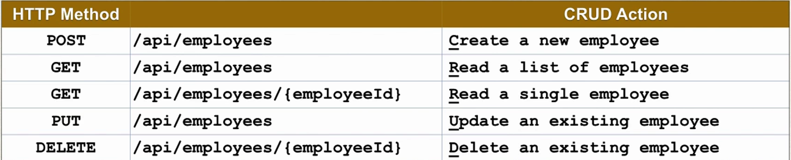
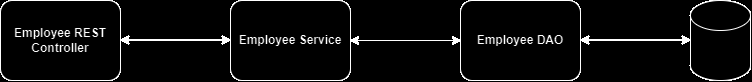
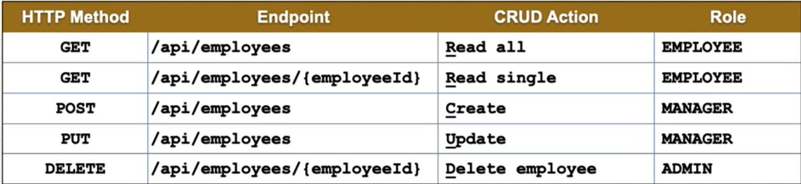
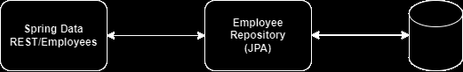

### API Requirements

Create a REST API for the employee directory, REST Client should be able to
- Get a list of employees
- Get a single employee by Id
- Add a new employee
- Update an employee
- Delete an employee

### REST API



### Development Process

- Set-up Database dev environment
- Create spring boot project using spring initializr
- Get a list of employees
- Get single employee by Id
- Add a new employee
- Update an existing employee
- Delete an existing employee

### Application Architecture



### 1. Set-up Database dev environment

```mysql
CREATE DATABASE  IF NOT EXISTS `employee_directory`;
USE `employee_directory`;

--
-- Table structure for table `employee`
--

DROP TABLE IF EXISTS `employee`;

CREATE TABLE `employee` (
  `id` int NOT NULL AUTO_INCREMENT,
  `first_name` varchar(45) DEFAULT NULL,
  `last_name` varchar(45) DEFAULT NULL,
  `email` varchar(45) DEFAULT NULL,
  PRIMARY KEY (`id`)
) ENGINE=InnoDB AUTO_INCREMENT=1 DEFAULT CHARSET=latin1;

--
-- Data for table `employee`
--

INSERT INTO `employee` VALUES 
	(1,'Leslie','Andrews','leslie@luv2code.com'),
	(2,'Emma','Baumgarten','emma@luv2code.com'),
	(3,'Avani','Gupta','avani@luv2code.com'),
	(4,'Yuri','Petrov','yuri@luv2code.com'),
	(5,'Juan','Vega','juan@luv2code.com');


```

### What is DAO in Spring?


In the context of Spring, "DAO" typically stands for "Data Access Object." It's a design pattern used to abstract and encapsulate all access to a data source, such as a database.

In Spring, DAOs are often implemented as classes or interfaces that define methods for performing CRUD (Create, Read, Update, Delete) operations on data. These DAOs usually handle the low-level interactions with the database, including querying, updating, and deleting data, while the rest of the application interacts with these DAOs to access or manipulate the data.

Spring provides support for DAOs through various mechanisms, including JDBC (Java Database Connectivity), JPA (Java Persistence API), and Spring Data, which simplifies the implementation of data access layers by providing repositories that can be easily configured and used within Spring applications.

Overall, DAOs in Spring help to decouple the business logic of an application from the details of how data is persisted, making the codebase more modular, maintainable, and testable.


### DAO development Process

- Update db configs in application.properties
- Create Employee entity
- Create DAO interface
- Create DAO implementation
- Create REST controller to use DAO

### Purpose of Service Layer

- Service Facade design pattern
- Intermediate layer for custom business logic
- Integrate data from multiple sources(DAO/repositories)

### Specialized Annotation for Services

- @Service applied to Service Implementations
- Spring will automatically register the Service implementation thanks to component scanning..

### Development Process for Employee Service

- Define Service interface
- Define Service implementation, Inject the EmployeeDAO

### Service Layer - Best Practice

- Best practice is to apply transactional boundaries at the service layer
- It is the service layer's responsibility to manage transaction boundaries
- For implementation code : 
    1. Apply @Transactional on service methods
  2. Remove @Transactional on DAO methods if they already exists

### JPA Repository


### SpringBoot REST API Security 

Development Process
- Create Spring Security Configuration (@Configuration)
- Add users, passwords and roles

### Restrict URLs based on Roles


### JDBC based Authentication - Development Process

- Develop SQL Script to set up database tables
- Add database support to Maven POM file
- Create JDBC properties file
- Update Spring Security Configuration to use JDBC
=======
In Spring Boot, a JPA repository is an interface provided by the Spring Data JPA module that allows you to interact with a database using the Java Persistence API (JPA) without writing much boilerplate code.

A JPA repository typically extends the JpaRepository interface, which is part of the Spring Data JPA framework. This interface provides various methods for common database operations such as CRUD (Create, Read, Update, Delete). You don't need to implement these methods yourself; Spring Data JPA generates the necessary queries based on method names and conventions.

Here's an example of how you might define a JPA repository interface in a Spring Boot application:

```java
import org.springframework.data.jpa.repository.JpaRepository;

public interface EmployeeRepository extends JpaRepository<Employee, Long> {
    // You can define custom query methods here if needed
}

```

You can reduce mode code using Spring Data REST



